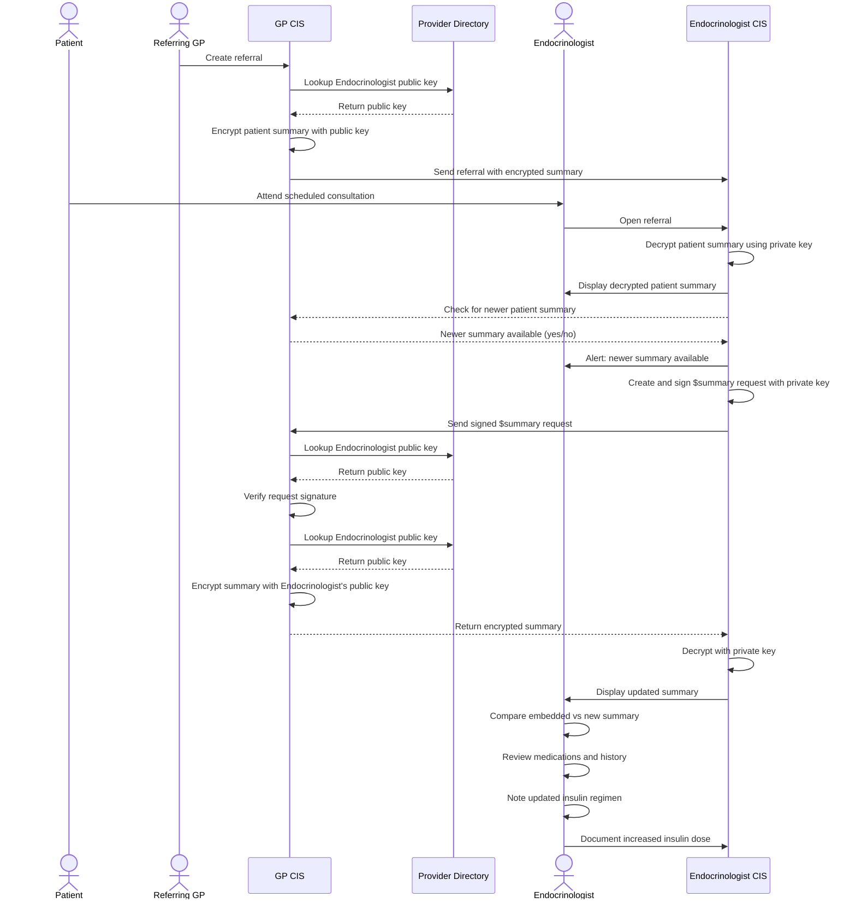

This use case demonstrates an example scenario where, during a specialist consultation, the specialist accesses the patient summary created at the time of the referral and confirms the latest patient summary available for a patient.

### Use Case Description

Joyce Johnson, a 39-year-old woman from New South Wales, is pregnant and has recently been diagnosed with gestational diabetes. To provide Joyce with more comprehensive support, her regular general practitioner (GP), Dr Ginger Burrows, refers Joyce to both an endocrinologist and a dietitian.

As part of the referral, Dr Burrows includes an embedded patient summary that captures Joyce’s medical history and current medications at the time. This embedded summary is curated from Dr Burrows' clinical information system (CIS) and attested at the time of creation, ensuring its integrity and alignment with clinical standards.

The referral is received and triaged by both the endocrinologist (Dr Bryce Cruickshank) and the dietitian. When Joyce later attends her appointment with Dr Cruickshank, the endocrinologist's CIS alerts the provider that a more recent patient summary is available from an external source - in this case, Dr Burrows’ CIS.

Dr Cruickshank accesses and compares both the original embedded summary and the newer version to verify the currency and accuracy of Joyce’s clinical information. The more recent patient summary has been generated at the time of request for access by Dr Burrows' CIS and digitally signed to ensure integrity in transit.

Based on updated data - particularly around Joyce's medication regimen - Dr Cruickshank adjusts Joyce’s insulin dosage and documents the decision.

An updated treatment plan is then shared with Joyce and Dr Burrows to maintain continuity of care across providers.

 
  

*Figure 1: Referral to Specialist and Allied Health consumer journey*
 

This use case demonstrates use of patient summary during step 4. Endocrinologist Consultation of the [Referral to Specialist and Allied Health consumer journey](https://sparked.csiro.au/index.php/sparked-products-resources/au-patient-summary-consumer-journeys/).

### Actors

#### People
1. Patient - Joyce Johnson
1. Referring GP - Dr Ginger Burrows
1. Endocrinologist - Dr Bryce Cruickshank

#### Systems
1. GP CIS
1. Endocrinologist CIS

### Precondition(s)
1. The referral from Dr Ginger Burrows includes a patient summary at the time of referral.
1. A more recent patient summary is available from Dr Burrows’ CIS at the time of consultation.
1. Dr Cruickshank’s CIS is capable of accessing and displaying both the embedded and updated patient summaries.

### Postcondition(s)
1. Dr Cruickshank uses the patient summary information to guide clinical decision-making.
1. Treatment changes, including the updated insulin dose, are documented in the CIS.
1. An updated treatment plan is shared with Joyce and Dr Burrows to support continuity of care.

### Flow
1. Joyce attends her scheduled consultation with Dr Cruickshank.
1. Dr Cruickshank opens the referral in their CIS and accesses and reviews the embedded patient summary.
1. The CIS alerts that a more recent patient summary is available.
1. Dr Cruickshank accesses the more recent patient summary, comparing the embedded patient summary to the more recent patient summary, and verifies consistency in medications and medical history.
1. Dr Cruickshank notes updated clinical information, including changes to Joyce’s insulin regimen.
1. Based on the review and discussion with Joyce, Dr Cruickshank decides to increase Joyce’s insulin dose and documents the decision in the CIS.

#### Sequence Diagram

*Figure 2: Sequence diagram showing access to embedded and updated patient summaries, with secure retrieval using public key cryptography*
 

### Notes

This example use case is provided for illustrative purposes only and is intended to support understanding of how patient summaries may be exchanged in practice. It does not prescribe technical requirements or mandate specific implementation workflows. 

### Examples

The following examples demonstrate technical and clinical use case aspects, conforming to the AU Patient Summary requirements. Data within these examples, e.g. medications, is provided by the [Sparked Patient Summary Clinical Focus Group](https://sparked.csiro.au/index.php/design-groups/):
1. Patient Summary Embedded in Referral: [Patient Summary for Joyce Johnson as of 28 OCT 2024 (Bundle)](Bundle-aups-referral-endoconsult-curated.html)
1. More recent Patient Summary: [Patient Summary for Joyce Johnson as of 07 NOV 2024 (Bundle)](Bundle-aups-referral-endoconsult-autogen.html)